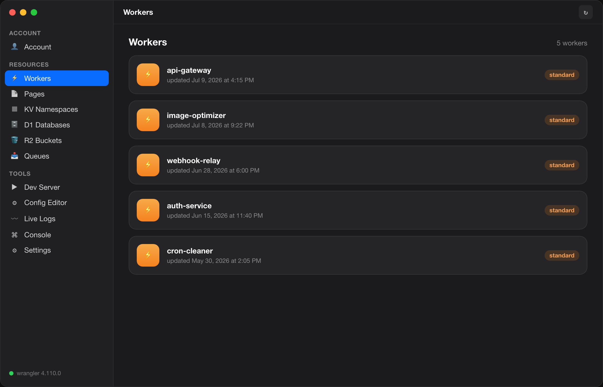
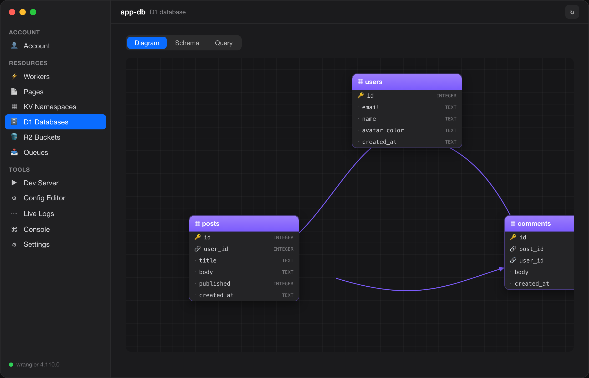
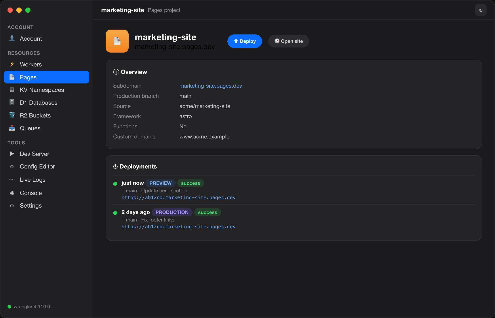

<div align="center">


# WranglerMac

**A native macOS app for managing Cloudflare from a beautiful GUI — powered by the Wrangler CLI.**

Workers · Pages · KV · D1 · R2 · Queues — browse, inspect, edit, and deploy without touching a terminal.


</div>

## Overview

WranglerMac is a SwiftUI desktop front-end for [Cloudflare Wrangler](https://developers.cloudflare.com/workers/wrangler/). It **bundles its own Node.js + wrangler runtime**, so everything works out of the box — nothing to install. Under the hood it drives the local `wrangler` binary and calls the Cloudflare API for the few things the CLI can’t list, then presents it all as a polished, card-based interface.

> The screenshots below use **demo data** (`WRANGLERMAC_DEMO=1`); no real account information is shown.

## Screenshots

### Workers
List every deployed Worker, then drill into deployments, versions, secrets, cron triggers, and a live‑logs tail.



### D1 — Entity-Relationship Diagram
Every D1 database renders as an interactive ERD (drag & zoom) plus a table/columns schema browser and a SQL console.



### Pages — with drag‑and‑drop deploy
Browse projects and deployments, manage secrets, and **create + deploy by dropping a folder, files, or a `.zip`**.



## Features

- **Account** — sign in with Wrangler’s OAuth flow; multi-account switcher.
- **Workers** — list all Workers (via the Cloudflare API); per-Worker overview, deployments & versions, rollback, environment secrets, cron triggers, inline live-logs tail, and delete.
- **Pages** — projects & deployment history with production/preview + status badges; environment secrets; **drag‑and‑drop create & deploy** (folder / files / `.zip`); open the live site.
- **KV** — browse namespaces and edit keys/values (add, edit, delete).
- **D1** — visual **ERD diagram**, schema browser (tables, columns, PK/FK, relations), and a `--remote` SQL console with a results grid.
- **R2** — browse buckets; get / put / delete objects by key.
- **Queues** — list queues; view info; pause / resume / purge.
- **Dev Server** — managed `wrangler dev` with start/stop and ready-URL detection.
- **Config Editor** — edit `wrangler.toml` / `.jsonc` / `.json` with validation and a cron-trigger builder.
- **Live Logs** — streaming `wrangler tail` with filtering.
- **Console** — an audit log of every wrangler command the app runs.
- **Self-contained runtime** — bundled Node.js + wrangler (incl. `workerd`), so no local install is required.
- **Dot-matrix loaders** and section-tinted, card-based UI throughout, in light & dark mode.

## How it works

- Shells out to the **bundled** `wrangler` (or an override you set in Settings) and decodes its output — inheriting Wrangler’s auth, config resolution, and forward-compatibility.
- For resources Wrangler can’t enumerate (Workers, Pages projects), it calls the **Cloudflare API** using Wrangler’s stored OAuth token, refreshing it via `wrangler whoami` when needed.
- Destructive actions (delete, purge, rollback) are always behind a confirmation dialog.

## Build & run

Requires macOS 14+, Xcode, and [XcodeGen](https://github.com/yonaskolb/XcodeGen).

```bash
# 1. Download Node + install wrangler into the app bundle (~320 MB, one-time)
./scripts/bundle-wrangler.sh

# 2. Generate the Xcode project and build
xcodegen generate
xcodebuild -project WranglerMac.xcodeproj -scheme WranglerMac -configuration Debug build

# 3. Run
open build/Build/Products/Debug/WranglerMac.app   # or open the project in Xcode
```

The bundled runtime (`Runtime/`) is git-ignored — regenerate it any time with `scripts/bundle-wrangler.sh`.

### Demo mode

Launch with `WRANGLERMAC_DEMO=1` to populate the UI with sample data (used for the screenshots above):

```bash
WRANGLERMAC_DEMO=1 build/Build/Products/Debug/WranglerMac.app/Contents/MacOS/WranglerMac
```

---

<div align="center">
Built with SwiftUI · not affiliated with Cloudflare.
</div>
